# Assignment 4: Performance Metrics, and Optimisation(Full mark)

### Student ID: 300637212                    Student Name: Xieji Li


## Part 1: Performance Metrics in Regression [30 marks]

### Requirements

### Based on exploratory data analysis, discuss what preprocessing that you need to do before regression, and provide evidence and justifications.

- Step1. Load Data && split the dataset

  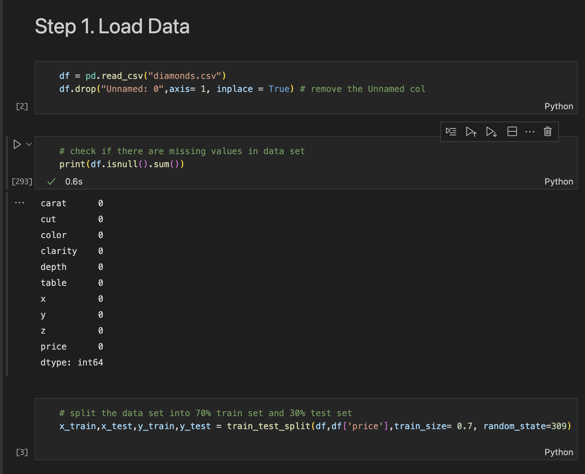
  
  

* Step 2. Initial Data Analysis

  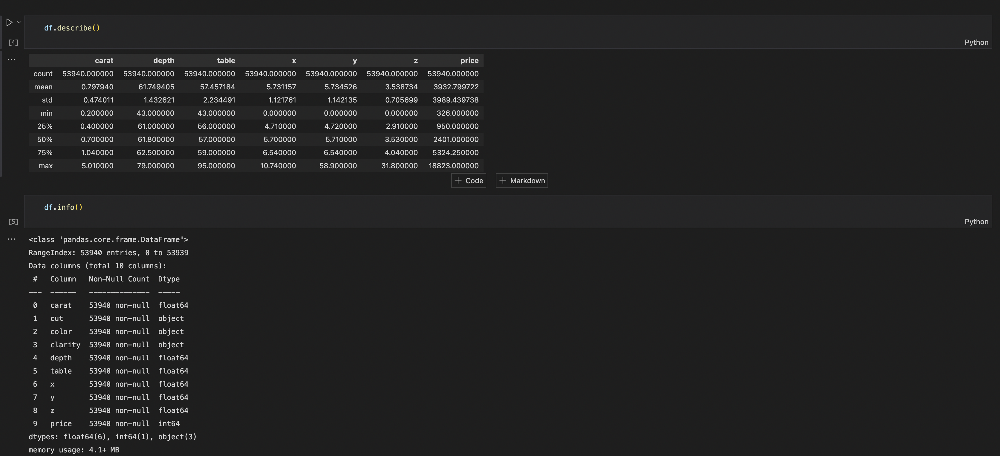

**Conclusion:** In this stage we can know there are 10 features in this dataset. We need to predict the value of price based on other 9 features. Also, there is no missing value in this dataset.

* correlation analysis

  Heat map

  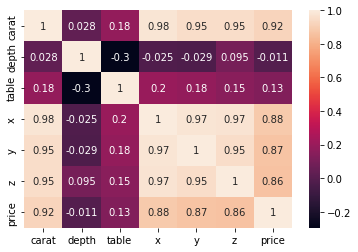

|           | Correlation |
| :-------: | :---------: |
| **carat** |  0.921591   |
|   **x**   |  0.884435   |
|   **y**   |  0.865421   |
|   **z**   |  0.861249   |
| **price** |  1.000000   |


* Step 3. Preprocess Data && Step 4. Exploratory Data Analysis

  * First, use histogram to display features, if the feature is numeric type then plot the hist according to the value of feature. If the feature is category type then plot the hist according to the frequency of the value.

  |                            carat                             |                             cut                              |                            Color                             |                           Clarity                            |                            Depth                             |
  | :----------------------------------------------------------: | :----------------------------------------------------------: | :----------------------------------------------------------: | :----------------------------------------------------------: | :----------------------------------------------------------: |
  |  | 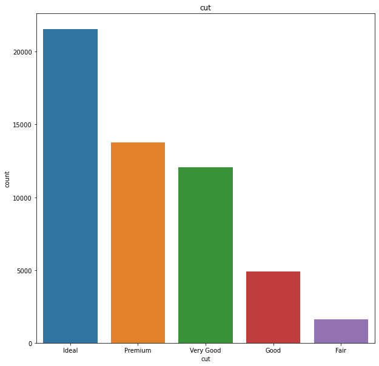 | 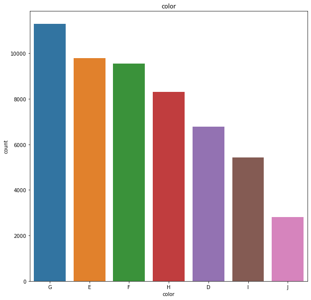 | 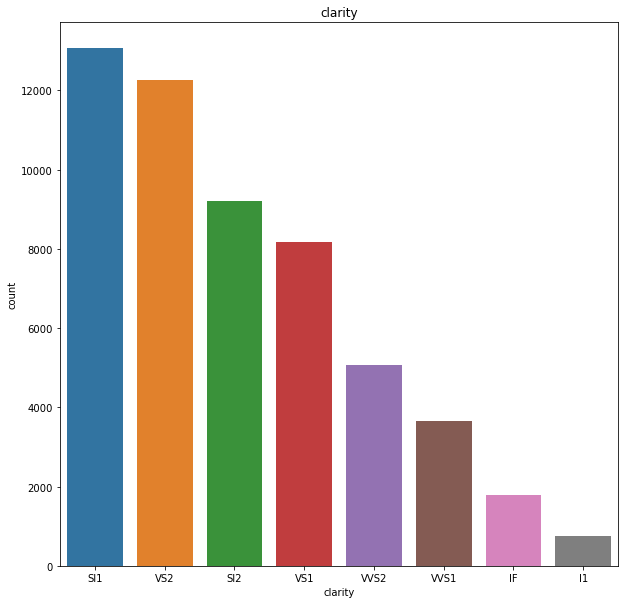 | 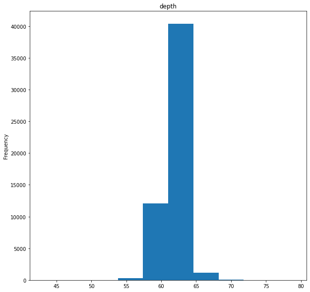 |
  |                          **table**                           |                            **x**                             |                            **y**                             |                            **z**                             |                          **price**                           |
  | 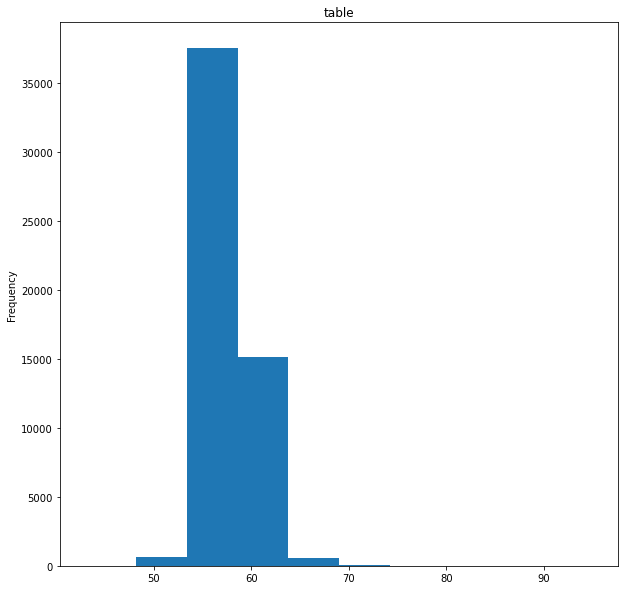 | 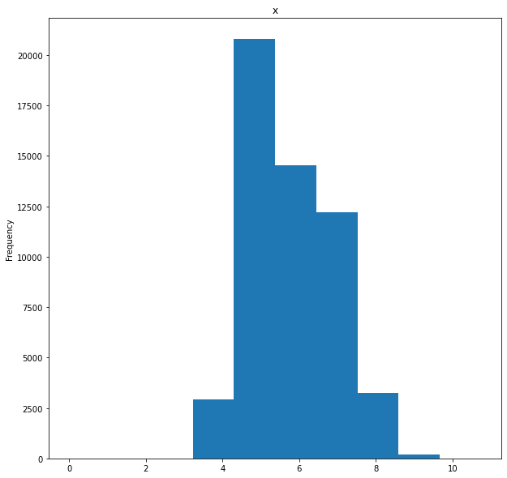 |  | 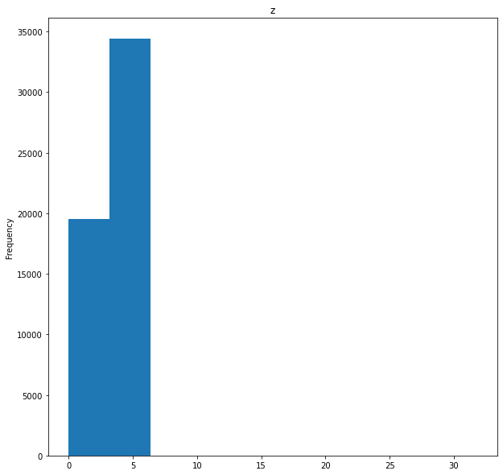 | 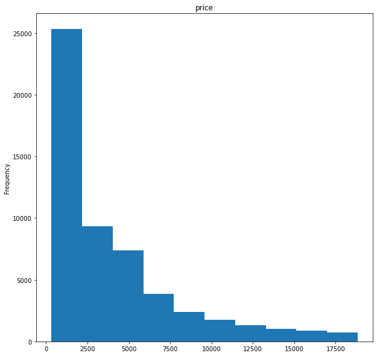 |

* Remove outliers

  1. In carat plot, remove the points - carat > 2.9
  2. In depth plot, remove the points - depth > 70 || depth <= 55
  3. In table plot, remove the points - table >= 70 || table  <= 50
  4. In x plot, remove the points - x >= 9 && price >= 15000
  5. In y plot, remove the points - y >= 20 || y == 0
  6. in z plot, remove the points - z >= 6 || z <= 1

* Right(origin), Left(after removing outliers)

  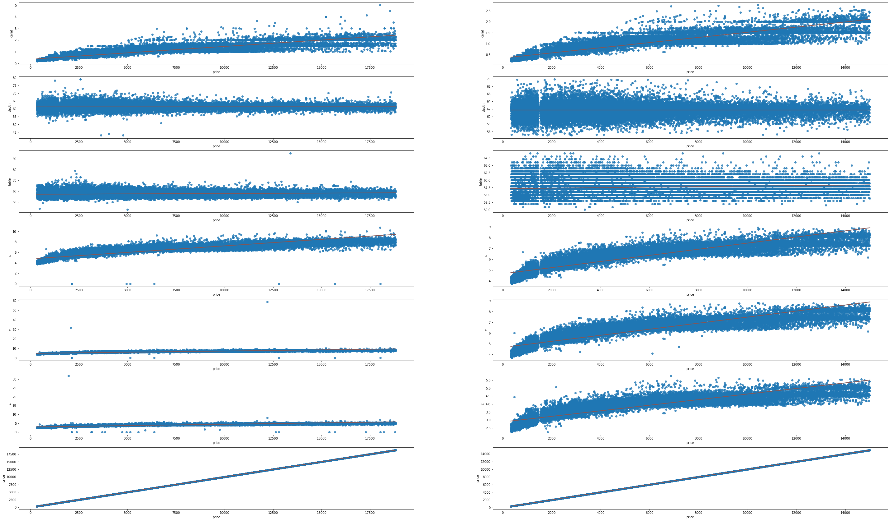

* Encode categorical features based on diamond documentation

  - cut
    
      | Ideal | Predium | Very Good | Good | Fair |
      | :---: | :-----: | :-------: | :--: | :--: |
      |  100  |   80    |    60     |  40  |  20  |

  - color
      - One Hot Encode

  - clarity
    
      |  I1  | SI2  | SI1  | VS2  | VVS2 | VVS1 |  IF  |
      | :--: | :--: | :--: | :--: | :--: | :--: | :--: |
      |  30  |  40  |  50  |  60  |  70  |  80  |  90  |

  * Standardization

    ```python
    # standardization
    scaler = StandardScaler()
    standard_train = scaler.fit_transform(preprocess_train)   
    standard_test = scaler.fit_transform(preprocess_test)
    ```

* Step 5. Build classification (or regression) models using the training data && Step 7. Assess model on the test data.

  |               Model               |                          Parameters                          |      MSE       |    RMSE     |   RSE    |    MAE     | excution time |
  | :-------------------------------: | :----------------------------------------------------------: | :------------: | :---------: | :------: | :--------: | :-----------: |
  |         linear regression         |                       positive = True                        | 1647909.22(7)  | 1283.71(7)  | 0.13(7)  | 816.89(7)  |   0.02s(2)    |
  |      k-neighbors regression       |                           Default                            | 1339014.10(6)  | 1157.16(6)  | 0.12(6)  | 554.29(6)  |   1.49s(5)    |
  |         Ridge regression          |                           Default                            | 2190847.01(9)  | 1480.15(9)  | 0.21(8)  | 848.85(8)  |   0.004s(1)   |
  |     decision tree regression      |                       Max_depth = None                       |  825284.43(4)  |  908.45(4)  | 0.06(4)  | 413.07(4)  |   0.02s(3)    |
  |     random forest regression      |                     n_estimators = 1000                      |  632325.04(2)  |  795.19(2)  | 0.05(2)  | 336.00(1)  |  1m50.00s(8)  |
  |   gradient Boosting regression    |                       Max_depth = none                       |  791343.44(3)  |  889.57(3)  | 0.06(3)  | 401.06(3)  |   17.83s(7)   |
  |          SGD regression           |                           Default                            | 2178494.94(8)  | 1475.97(8)  | 0.22(10) | 864.34(10) |   0.20s(4)    |
  |  support vector regression (SVR)  |                            C=1500                            |  998458.52(5)  |  999.23(5)  | 0.09(5)  | 524.38(5)  |  3m6.66s(9)   |
  |            linear SVR             | max_iter=50000, C = 5.0, loss = 'squared_epsilon_insensitive' ,dual = True | 2201090.06(10) | 1483.61(10) | 0.21(9)  | 848.94(9)  |   10.78s(6)   |
  | multi-layer perceptron regression |                        max_iter=5000                         |  570093.37(1)  |  755.05(1)  | 0.04(1)  | 391.20(2)  | 3m22.46s(10)  |

  ### Discussion

  From the table, we can find that multi-layer-preceptron regression, random forest, and gradient boosting regression have a good performance in diamond dataset, but there are some simple model doesn't suitable for this datset(SGD, linear SVR). Although those simple model take short time in excution stage, they still can't get a great performance. MLP and random forest model takes a long time in excution, but those two model won't be influenced by similar linear features and they will analysis the relationship between features(which help those two model have a better performance than other models). 

## Part 2: Performance Metrics in Classification [30 marks]

### Requirement

- Based on exploratory data analysis, discuss what preprocessing that you need to do before classification, and provide evidence and justifications.

  * Initial data exploration

    * Use  Pandas Profilling Report
    * 

    So we can find that there are missing value in train dataset, I desided to drop all instanced with missing values in both train and test set.

    ```python
    # replace " ?" value with np.nan
    train.replace({"?": np.nan}, inplace = True)
    test.replace({"?": np.nan}, inplace = True)
    
    # Drop the instance with missing value
    train.dropna(inplace = True)
    test.dropna(inplace = True)
    ```

    * Result

      The shape of train set:  (32561, 15) $\rightarrow$ (30162, 15)
      The shape of test set:  (16281, 15) $\rightarrow$(15060, 15)

    * Plot the histogram of each features 

      |                             Age                              |                          Work class                          |                            Fnglwt                            |                          Education                           |                        Education-num                         |
      | :----------------------------------------------------------: | :----------------------------------------------------------: | :----------------------------------------------------------: | :----------------------------------------------------------: | :----------------------------------------------------------: |
      | 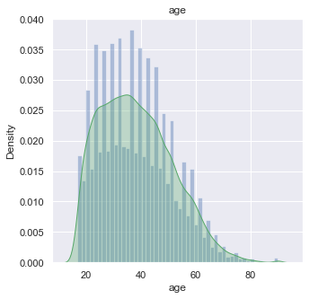 | 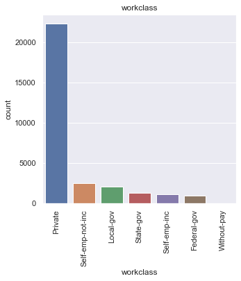 | 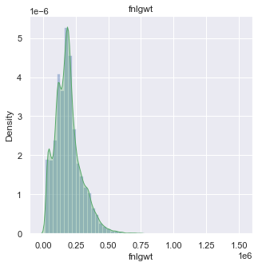 | 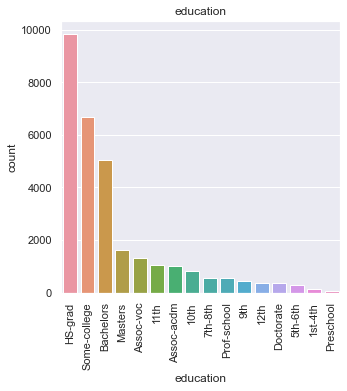 | 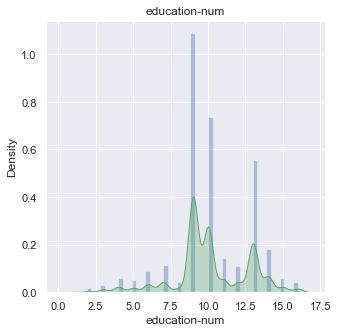 |
      |                       **Relationship**                       |                           **Race**                           |                           **sex**                            |                       **Capital-gain**                       |                       **Capital-loss**                       |
      | 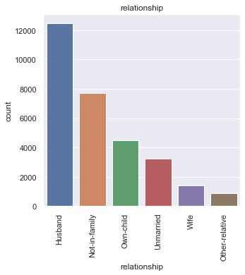 | 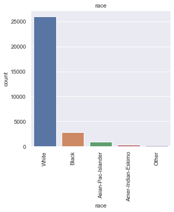 | 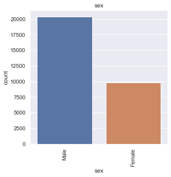 | 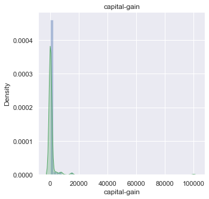 | 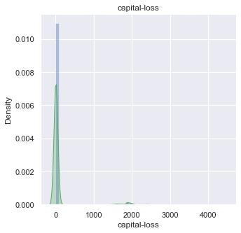 |
      |                      **Hours-per-week**                      |                      **Native-country**                      |                          **Salary**                          |                                                              |                                                              |
      | 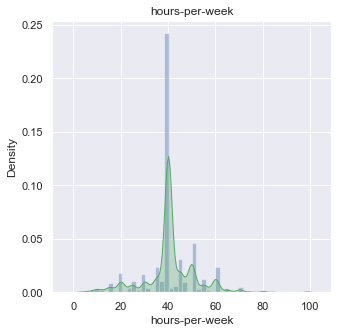 | 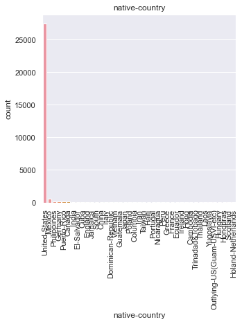 | 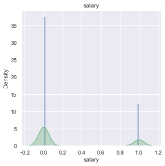 |                                                              |                                                              |

      * From the plot we can find that there are:
        * numeric features: ['age', 'fnlgwt', 'education-num', 'capital-gain', 'capital-loss', 'hours-per-week', 'salary'] 
        * category features: ['workclass', 'education', 'marital-status', 'occupation', 'relationship', 'race', 'sex', 'native-country']

    *  Correlation Heatmap

      

    * **One-hot encoding category features**

    * ```python
      def onehotencode(train,test,cols):
          for col in cols:
              setA = set(train[col])
              setB = set(test[col])
      
              # replace artist name
              test[col] = test[col].replace(setA.difference(setB),'null')
              train[col] = train[col].replace(setB.difference(setA),'null')
      
              test[col] = test[col].replace(setB.difference(setA),'null')
              train[col] = train[col].replace(setA.difference(setB),'null')
      
              train.drop(train[train[col] == 'null'].index,inplace= True,axis=0)
              test.drop(test[test[col] == 'null'].index,inplace= True,axis=0)
      
              train = pd.concat([train,pd.get_dummies(train[col])],axis = 1)
              train = train.drop(col,axis = 1)
      
              test = pd.concat([test,pd.get_dummies(test[col])],axis = 1)
              test = test.drop(col,axis = 1)
      
          return train,test
        
      coded_train,coded_test = onehotencode(train.copy(),test.copy(),cat_col)
      # print the shape of train set and test set
      print("The shape of train set: ", coded_train.shape)
      print("The shape of test set: ", coded_test.shape)
      
      ```

      **The shape of train set:  (30161, 104)** 

      **The shape of test set:  (15060, 104)**

    * Find the high correlation features with salary

    * ```python
      corrMatrix = coded_train.corr(method="pearson")
      
      # find the features have high correlation with salary
      salary_corr = coded_train.corr()[['salary']]
      high_salary_corr = salary_corr.loc[abs(salary_corr['salary']) > 0.1] # pick the feature which has more than 10% correlation
      high_corrFeature_list = high_salary_corr.index.to_list()
      high_salary_corr.sort_values(by="salary",ascending=False)
      ```

      

    * Demension reduction based on correlation

      ```python
      # Dimension reduction 
      high_corrFeature_list
      reduced_train = coded_train[high_corrFeature_list]
      reduced_test = coded_test[high_corrFeature_list]
      ```

      ***origin features number: 104* $\rightarrow$ now: 25**

- Report the results (keep 2 decimals) of all the 10 classification algorithms on the given test data in terms of classification accuracy, precision, recall, F1-score, and AUC. You should report them in a table.

​			In this part, I use default parameters in every model

|          Model name          | Accuracy | Precision |  Recall  | F1-score |   AUC    |
| :--------------------------: | :------: | :-------: | :------: | :------: | :------: |
|             KNN              | 0.84(4)  |  0.70(6)  | 0.62(2)  | 0.66(3)  | 0.77(3)  |
|         Naive Bayes          | 0.83(7)  |  0.66(8)  | 0.64(1)  | 0.65(4)  | 0.77(4)  |
|             SVM              | 0.80(10) |  0.73(4)  | 0.27(10) | 0.39(10) | 0.62(10) |
|        Decision Tree         | 0.82(8)  |  0.64(9)  | 0.59(6)  | 0.61(8)  | 0.74(7)  |
|        Random Forest         | 0.84(5)  |  0.70(7)  | 0.61(4)  | 0.65(5)  | 0.76(5)  |
|           AdaBoost           | 0.86(2)  |  0.76(2)  | 0.60(5)  | 0.67(2)  | 0.77(2)  |
|      Gradient Boosting       | 0.86(1)  |  0.79(1)  | 0.61(3)  | 0.69(1)  | 0.78(1)  |
| Linear discriminant analysis | 0.84(6)  |  0.71(5)  | 0.55(8)  | 0.62(7)  | 0.74(8)  |
|    Multi-layer perceptron    | 0.84(3)  |  0.75(3)  | 0.55(9)  | 0.63(6)  | 0.74(6)  |
|     Logistic regression      | 0.81(9)  | 0.63(10)  | 0.55(7)  | 0.59(9)  | 0.72(9)  |


- Find the two best algorithms according to each of the four performance metrics, Are they the same? Explain why.
  * Accuracy
    * Definition: Predicted correct results as a percentage of the total sample
    * $Accuracy = \frac{TP + TN}{TP+FP+TN+FN}$
    * Best two models: Gradient Boosting, AdaBoost
  * Precision
    * Definition: The probability that all predicted positive samples are actually positive
    * $Precision = \frac{TP}{TP + FP}$
    * Best two models: Gradient Boosting, AdaBoost
  * Recall
    * The probability of being predicted to be positive among the actual positive samples
    * $Recall = \frac{TP}{TP + FN}$
    * Best two models: KNN, Naive Bayes
  * F1-Score
    * Harmonic mean of precision and recall
    *  $F_1 = 2\frac{Precission \cdot Recall}{Precission + Recall}$
    * Best two models: Gradient Boosting, AdaBoost
  * AUC(Area Under the ROC curve)
    * Gives an overall measure of a classifier’s performance
    * Best two models: Gradient Boosting, AdaBoost

The best models in **Accuracy, Precision, F1-score and AUC** are **same**(Gradient Boosting, AdaBoost), but the best model in Recall are KNN and Naive Bayes.

### Why are they mostly the same?

Accuracy by quantifying the correct rate predicted by the model provides an intuitive way for us to evaluate the model. 

precision represents the accuracy of the model for positive samples.

Recall describes the ability of the model to predict the correct rate of positive samples.

However, the F1-score is a hamonic mean of precision and recall, so its result will be simillar with precision and recall.

AUC is a better measure than accuracy based on formal definitions of discriminancy and consistency.

To sum up, the F1 score is based on precision and recall, and F1, AUC, and accuracy can all be used to evaluate the model generally, which is why the results are almost the same (because Gradient Boosting, AdaBoost, while maintaining high precision, It also maintains recall at a moderately high level, which results in a high composite score for both models relative to the other models)

From accuracy and AUC, we can have a general evaluation on models. But if we want to apply our model on some specific condition, we have to evaluate our model by Precision and Recall.

